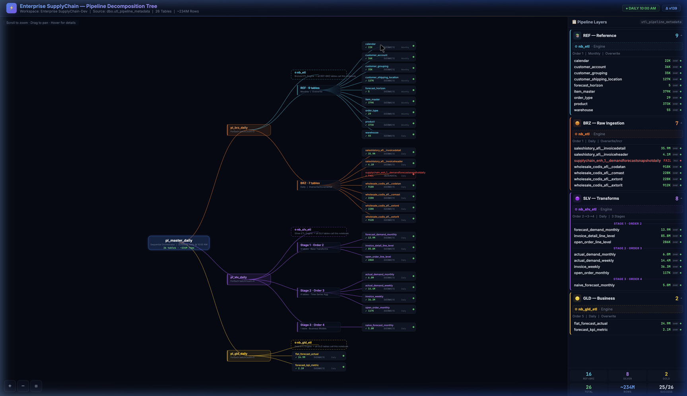

# 🏗️ Fabric Pipeline Decomposition Tree

> Interactive D3.js visualization of Microsoft Fabric ETL pipeline workflows — auto-generated from live workspace metadata via MCP Fabric.

[](https://ankinguyen-engineer-2002.github.io/fabric_template_pipeline_decomposition/)



---

## 📋 What Is This?

A **reusable template** that scans your Microsoft Fabric workspace using MCP (Model Context Protocol) tools and generates a professional, interactive decomposition tree showing your ETL pipeline architecture:

- 🔍 **Auto-scans** workspace pipelines, notebooks, and Lakehouse metadata
- 🌲 **Generates** a horizontal D3.js tree diagram with full hierarchy
- 📊 **Shows** row counts, load types, execution status, and data lineage per table
- 🎨 **Medallion Architecture** — REF/BRZ/SLV/GLD layers with distinct color coding
- ⚡ **Engine Pattern** — visualizes `nb_etl`, `nb_slv_etl`, `nb_gld_etl` notebook engines

---

## 🚀 Quick Start

### Prerequisites

- [MCP Fabric Server](https://github.com/microsoft/fabric-mcp) configured and authenticated
- Azure CLI logged in (`az login`)
- Access to the target Fabric workspace

### Step-by-Step: Scan & Generate

Follow these steps to scan your Fabric workspace and generate the visualization.

> **Full runbook with exact MCP commands:** see [docs/scan_fabric_runbook.md](docs/scan_fabric_runbook.md)

#### Step 1: List Workspaces → Find Target

```
MCP Tool: mcp_fabric_onelake
Command: onelake_list_workspaces
→ Returns all accessible workspaces with IDs
→ Find your workspace ID (e.g. c8d9fc83-18b6-4e1d-8264-0b49eed36fe0)
```

#### Step 2: List Items → Find Pipelines & Lakehouses

```
MCP Tool: mcp_fabric_onelake
Command: onelake_list_items
Parameters: workspace="Enterprise SupplyChain-Dev"
→ Returns all items: Pipelines, Notebooks, Lakehouses, etc.
→ Identify: pl_master_daily, pl_brz_daily, pl_slv_daily, pl_gld_daily
→ Identify: SupplyChain_Lakehouse (artifactId: 62a3081e-...)
```

#### Step 3: List Lakehouse Tables

```
MCP Tool: mcp_fabric_onelake
Command: onelake_list_files
Parameters: workspace=<ID>, item="SupplyChain_Lakehouse.Lakehouse", path="Tables"
→ Lists all Delta tables including dbo.utl_pipeline_metadata
```

#### Step 4: Download Pipeline Definitions (Base64)

```
MCP Tool: mcp_fabric_docs
Command: docs_get-openapi-spec
Parameters: workload-type="dataPipeline"
→ Understand the getDefinition API structure

Then for each pipeline (pl_brz_daily, pl_slv_daily, pl_gld_daily):
→ Retrieve definition → Base64 decode → Extract activities JSON
→ Key info: Lookup SQL query, ForEach batchCount, notebook references
```

#### Step 5: Read Metadata Table (Critical Step)

```
MCP Tool: mcp_fabric_onelake
Command: onelake_list_files
Parameters: path="Tables/dbo.utl_pipeline_metadata/_delta_log", recursive=true
→ Find the latest parquet data files

MCP Tool: mcp_fabric_onelake
Command: onelake_download_file
Parameters: file-path="Tables/dbo.utl_pipeline_metadata/<parquet_files>"
→ Download each parquet file
→ Parse with Python (pandas/pyarrow) to extract all 26 metadata rows
```

#### Step 6: Update the DATA Array in `index.html`

Replace the `const DATA = [...]` array in `index.html` with your extracted metadata:

```javascript
const DATA = [
  {layer:'REF', order:1, table:'ref_calendar_2', load:'overwrite', freq:'Monthly', rows:21551, status:'success', nb:'1f372050-e7ac', runtime:'41s'},
  {layer:'BRZ', order:1, table:'brz_saleshistory_afi__invoicedetail_2', load:'overwrite', freq:'Daily', rows:35880410, status:'success', nb:'24e6e753-4985', runtime:'461s'},
  // ... all 26 rows
];
```

#### Step 7: Open `index.html` in Browser 🎉

```bash
open index.html
# or deploy to GitHub Pages
```

---

## 📁 Project Structure

```
├── index.html                      # D3.js visualization (the main deliverable)
├── README.md                       # This file
├── docs/
│   ├── scan_fabric_runbook.md      # Full MCP Fabric scan runbook
│   └── architecture.md             # Medallion architecture documentation
└── examples/
    └── sample_metadata.json        # Example utl_pipeline_metadata output
```

---

## 🎨 Features

| Feature | Description |
|---|---|
| **Horizontal Tree** | Left-to-right D3.js layout with cubic bezier links |
| **5 Node Types** | Master → Pipeline → Engine → Group → Table |
| **Color-coded Layers** | 🔵 REF (cyan) · 🟠 BRZ (orange) · 🟣 SLV (purple) · 🟡 GLD (gold) |
| **Rich Tooltips** | Hover any node for metadata: rows, status, runtime, lineage |
| **Sidebar Panel** | Collapsible layer panels with engine badges and table lists |
| **Zoom/Pan** | d3.zoom() with +/−/⊞ controls |
| **Failed Tables** | Red-highlighted nodes for failed ETL loads |
| **Status Indicators** | Green/Red dots per table showing last run status |

---

## 🏛️ Architecture

The pipeline follows the **Medallion Architecture** pattern:

```
pl_master_daily (Sequential Orchestrator @ 10:00 AM)
├── pl_brz_daily → nb_etl (Engine)
│   ├── REF Layer: 9 reference tables (Monthly, Overwrite)
│   └── BRZ Layer: 7 raw ingestion tables (Daily, Overwrite/Incremental)
├── pl_slv_daily → nb_slv_etl (Engine)
│   ├── Stage 1 · Order 2: 3 base transform tables
│   ├── Stage 2 · Order 3: 4 time-series aggregation tables
│   └── Stage 3 · Order 4: 1 business model table
└── pl_gld_daily → nb_gld_etl (Engine)
    └── GLD Layer: 2 business-ready analytics tables
```

All pipelines are **metadata-driven** — they read `dbo.utl_pipeline_metadata` in `SupplyChain_Lakehouse` to determine which tables to process, using a ForEach pattern that calls the engine notebook with parameters.

---

## 🔧 How to Customize

1. **Change workspace**: Update workspace IDs in the runbook
2. **Add layers**: Add new layer colors in the `COL` and `COL2` objects
3. **Modify tree**: Edit the `hier` object in `index.html` to restructure groups
4. **Style changes**: All CSS is inline — modify the `<style>` block

---

## 📄 License

MIT — Free to use, modify, and distribute.

---

## 👤 Author

**An Ki Nguyen** — Supply Chain Data Engineer
- GitHub: [@ankinguyen-engineer-2002](https://github.com/ankinguyen-engineer-2002)
