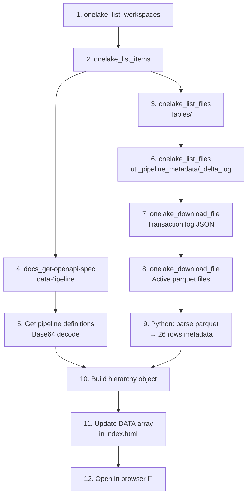

# 📘 MCP Fabric Scan Runbook

> Complete step-by-step guide to scan a Microsoft Fabric workspace and extract all metadata needed for the Pipeline Decomposition Tree visualization.

---

## Prerequisites

| Requirement | Detail |
|---|---|
| **MCP Fabric Server** | `fabric-mcp` installed and running |
| **Authentication** | Azure CLI (`az login`) or Managed Identity |
| **Workspace Access** | Reader role on target Fabric workspace |
| **Python 3.10+** | For parsing parquet files |
| **Dependencies** | `pip install pyarrow pandas` |

---

## Phase 1: Workspace Discovery

### Step 1.1 — List All Workspaces

```
Tool: mcp_fabric_onelake
Command: onelake_list_workspaces
Parameters: {}
```

**Output:** List of all accessible workspaces with names and IDs.

```json
{
  "workspaces": [
    {"name": "Enterprise SupplyChain-Dev", "id": "c8d9fc83-18b6-4e1d-8264-0b49eed36fe0"},
    {"name": "Other-Workspace", "id": "..."}
  ]
}
```

**Action:** Note your target workspace ID → `WORKSPACE_ID`

---

### Step 1.2 — List All Items in Workspace

```
Tool: mcp_fabric_onelake
Command: onelake_list_items
Parameters: { "workspace": "<WORKSPACE_ID>" }
```

**Output:** All Fabric items — Pipelines, Notebooks, Lakehouses, etc.

**What to extract:**

| Item Type | Name | ID | Purpose |
|---|---|---|---|
| DataPipeline | `pl_master_daily` | `4214332e-...` | Master orchestrator |
| DataPipeline | `pl_brz_daily` | `e388c9ef-...` | Bronze layer pipeline |
| DataPipeline | `pl_slv_daily` | `188d52f4-...` | Silver layer pipeline |
| DataPipeline | `pl_gld_daily` | `8a8fabf1-...` | Gold layer pipeline |
| Notebook | `nb_etl` | `...` | Bronze ETL engine |
| Notebook | `nb_slv_etl` | `...` | Silver ETL engine |
| Notebook | `nb_gld_etl` | `...` | Gold ETL engine |
| Lakehouse | `SupplyChain_Lakehouse` | `62a3081e-...` | Delta Lake storage |

---

## Phase 2: Pipeline Definition Extraction

### Step 2.1 — Understand DataPipeline API

```
Tool: mcp_fabric_docs
Command: docs_get-openapi-spec
Parameters: { "workload-type": "dataPipeline" }
```

**Output:** OpenAPI spec showing the `getDefinition` endpoint structure. Key: pipeline definitions are returned as **base64-encoded JSON** in the `parts[].payload` field.

---

### Step 2.2 — Get Pipeline Definitions

For each sub-pipeline (`pl_brz_daily`, `pl_slv_daily`, `pl_gld_daily`), retrieve and decode the definition.

The API returns:
```json
{
  "definition": {
    "parts": [
      {
        "path": "pipeline-content.json",
        "payload": "<BASE64_ENCODED_JSON>",
        "payloadType": "InlineBase64"
      }
    ]
  }
}
```

**Decode with Python:**
```python
import base64, json

payload = "<BASE64_STRING>"
decoded = json.loads(base64.b64decode(payload).decode('utf-8'))
print(json.dumps(decoded, indent=2))
```

### Step 2.3 — Key Findings from Pipeline Definitions

#### pl_master_daily (Orchestrator)
```
Activity 1: InvokePipeline → pl_brz_daily (dependsOn: [])
Activity 2: InvokePipeline → pl_slv_daily (dependsOn: pl_brz_daily.Succeeded)
Activity 3: InvokePipeline → pl_gld_daily (dependsOn: pl_slv_daily.Succeeded)
```

#### pl_brz_daily (Bronze + Reference)
```
Activity 1: Lookup_DueNotebooks
  → SQL: SELECT table_name, notebook_name
          FROM dbo.utl_pipeline_metadata
          WHERE is_active = 1 AND layer = 'BRZ' AND execution_order = 1
          AND next_run_time <= CURRENT_TIMESTAMP
  → Source: SupplyChain_Lakehouse

Activity 2: ForEach_RunNotebooks
  → items: @activity('Lookup_DueNotebooks').output.value
  → batchCount: 3
  → Inner Activity: nb_etl (TridentNotebook)
    → notebookId: @item().notebook_name (Expression)
```

#### pl_slv_daily (Silver)
```
Activity 1: Lookup_DueNotebooks_order2
  → SQL: WHERE layer = 'SLV' AND execution_order = 2
Activity 2: ForEach → nb_slv_etl (batchCount=4)
Activity 3: Lookup_DueNotebooks_order3
  → SQL: WHERE layer = 'SLV' AND execution_order = 3
Activity 4: ForEach → nb_slv_etl (sequential, depends on order2)
Activity 5: Lookup_DueNotebooks_order4
Activity 6: ForEach → nb_slv_etl (depends on order3)
```

#### pl_gld_daily (Gold)
```
Activity 1: Lookup → WHERE layer = 'GLD' AND execution_order = 5
Activity 2: ForEach → nb_gld_etl (batchCount=3)
```

---

## Phase 3: Metadata Table Extraction

This is the **most critical step** — extracting `dbo.utl_pipeline_metadata` which contains all 26 table definitions.

### Step 3.1 — Browse the Delta Table Structure

```
Tool: mcp_fabric_onelake
Command: onelake_list_files
Parameters: {
  "workspace": "<WORKSPACE_ID>",
  "item": "SupplyChain_Lakehouse.Lakehouse",
  "path": "Tables/dbo.utl_pipeline_metadata",
  "recursive": true
}
```

**Output:** Delta Lake file structure:
```
Tables/dbo.utl_pipeline_metadata/
├── _delta_log/
│   ├── 00000000000000000000.json    (initial commit)
│   ├── ...
│   └── 00000000000000000139.json    (latest commit v139)
├── part-00000-...-c000.snappy.parquet
├── part-00001-...-c000.snappy.parquet
├── part-00002-...-c000.snappy.parquet
└── part-00003-...-c000.snappy.parquet
```

### Step 3.2 — Read Delta Transaction Log

```
Tool: mcp_fabric_onelake
Command: onelake_download_file
Parameters: {
  "workspace": "<WORKSPACE_ID>",
  "item": "SupplyChain_Lakehouse.Lakehouse",
  "file-path": "Tables/dbo.utl_pipeline_metadata/_delta_log/00000000000000000139.json"
}
```

**Parse the transaction log** to determine which parquet files are currently active (not removed). The log contains `add` and `remove` actions.

### Step 3.3 — Download Active Parquet Files

```
Tool: mcp_fabric_onelake
Command: onelake_download_file
Parameters: {
  "file-path": "Tables/dbo.utl_pipeline_metadata/<active_parquet_file>"
}
```

Download all active parquet files, then parse them:

```python
import pyarrow.parquet as pq
import pandas as pd

# Read all downloaded parquet files
df = pd.concat([pq.read_table(f).to_pandas() for f in parquet_files])
print(df[['table_name','layer','execution_order','load_type','is_active','row_count','status']])
```

### Step 3.4 — Expected Output: 26 Rows

| # | table_name | layer | order | load_type | freq | rows | status |
|---|---|---|---|---|---|---|---|
| 1 | ref_calendar_2 | REF | 1 | overwrite | Monthly | 21,551 | success |
| 2 | ref_customer_account_2 | REF | 1 | overwrite | Monthly | 35,535 | success |
| 3 | ref_customer_grouping_2 | REF | 1 | overwrite | Monthly | 35,439 | success |
| 4 | ref_customer_shipping_location_2 | REF | 1 | overwrite | Monthly | 127,360 | success |
| 5 | ref_forecast_horizon_2 | REF | 1 | overwrite | Monthly | 5 | success |
| 6 | ref_item_master_2 | REF | 1 | overwrite | Monthly | 379,236 | success |
| 7 | ref_order_type_2 | REF | 1 | overwrite | Monthly | 29 | success |
| 8 | ref_product_2 | REF | 1 | overwrite | Monthly | 373,326 | success |
| 9 | ref_warehouse_2 | REF | 1 | overwrite | Daily | 55 | success |
| 10 | brz_saleshistory_afi__invoicedetail_2 | BRZ | 1 | overwrite | Daily | 35,880,410 | success |
| 11 | brz_saleshistory_afi__invoiceheader_2 | BRZ | 1 | overwrite | Daily | 4,094,639 | success |
| 12 | brz_supplychain_enh_1__demandforecastsnapshotdaily_2 | BRZ | 1 | incremental | Daily | 0 | failed |
| 13 | brz_wholesale_codis_afi__codatan_2 | BRZ | 1 | overwrite | Daily | 918,213 | success |
| 14 | brz_wholesale_codis_afi__comast_2 | BRZ | 1 | overwrite | Daily | 228,030 | success |
| 15 | brz_wholesale_codis_afi__extord_2 | BRZ | 1 | overwrite | Daily | 228,022 | success |
| 16 | brz_wholesale_codis_afi__extorit_2 | BRZ | 1 | overwrite | Daily | 912,132 | success |
| 17 | slv_forecast_demand_monthly_2 | SLV | 2 | overwrite | Daily | 13,876,949 | success |
| 18 | slv_invoice_detail_line_level_2 | SLV | 2 | overwrite | Daily | 85,813,137 | success |
| 19 | slv_open_order_line_level_2 | SLV | 2 | overwrite | Daily | 285,650 | success |
| 20 | slv_actual_demand_monthly_2 | SLV | 3 | overwrite | Daily | 6,011,419 | success |
| 21 | slv_actual_demand_weekly_2 | SLV | 3 | overwrite | Daily | 14,404,515 | success |
| 22 | slv_invoice_weekly_2 | SLV | 3 | overwrite | Daily | 36,326,734 | success |
| 23 | slv_open_order_monthly_2 | SLV | 3 | overwrite | Daily | 116,963 | success |
| 24 | slv_naive_forecast_monthly_2 | SLV | 4 | overwrite | Daily | 5,039,005 | success |
| 25 | gld_flat_forecast_actual_2 | GLD | 5 | overwrite | Daily | 24,927,373 | success |
| 26 | gld_forecast_kpi_metric_2 | GLD | 5 | overwrite | Daily | 2,089,706 | success |

**Total: ~234M rows across 26 tables. 25/26 successful.**

---

## Phase 4: Generate Visualization

### Step 4.1 — Transform Data to JavaScript Array

Convert the metadata table to the `DATA` array format in `index.html`:

```javascript
const DATA = [
  {layer:'REF', order:1, table:'ref_calendar_2', load:'overwrite', freq:'Monthly',
   rows:21551, status:'success', nb:'1f372050-e7ac', runtime:'41s'},
  // ... repeat for all 26 rows
];
```

### Step 4.2 — Update `index.html`

Replace the `const DATA = [...]` block in `index.html` with your generated data.

### Step 4.3 — Open in Browser

```bash
open index.html
```

The D3.js tree will automatically render the full decomposition tree from left to right.

---

## Summary: Tool Call Sequence


